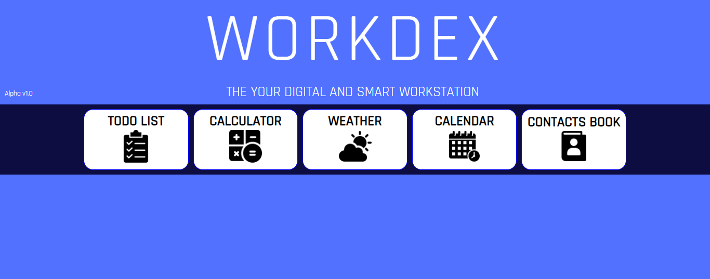

# Workdex 

## The your smart and digital workstation

#### Version: **Alpha 1.0**
### Author-developer: **Antonio Lobusto**

* [General Info](#generalinfo)
* [Technologies](#technologies)
* [Dashboard and tools](#dashboardandtools)
* [Vision](#vision)
* [Next Level](#nextlevel)
* [Preview] (#preview)

## General info
This project opensource is a web  app to smart working. It is about a fluid-dashboard with many tools inside.
It is an alpha version built with simple fronte-end languages. 

	
## Technologies
Project is created with:
*HTML
*CSS
*Javascript
*Libraries JS

	
## Dashboard and tools 

The user dashboard is a composite layout of five "modules" (divs) that each host a tool.

Tools list:

1. Calculator
2. ToDo List
3. Weather App
4. Calendar
5. Contacts Book

## Vision
The app is created to facilitate the working life of people who use agile work from own home.
This first version is a starting point of what the app will actually be in its full functional efficiency.

## Next level
The next step is to switch to a beta version with user memory data. I will form a development team for the actual implementation of the web app. The language I will focus on will be php with Laravel support.
Most likely, we will open another shared repository for the beta.

## Preview

;